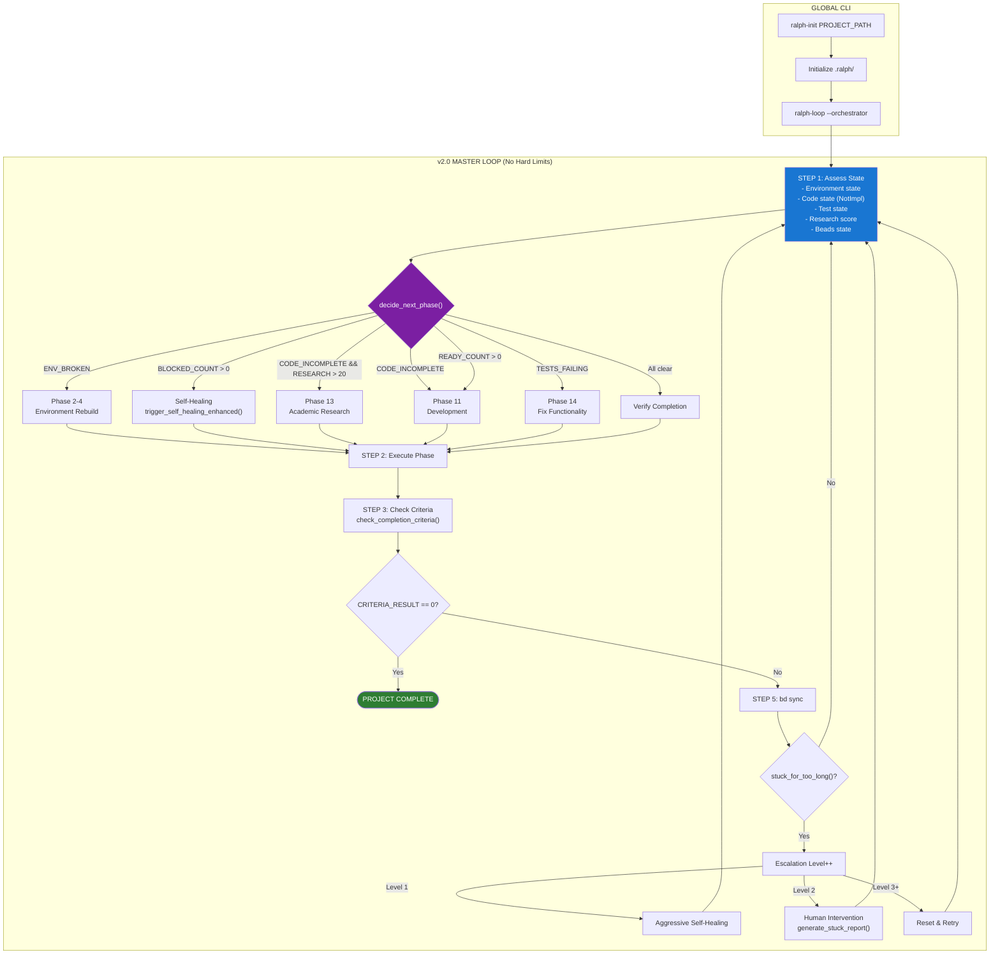
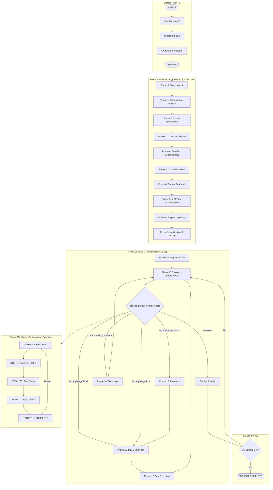
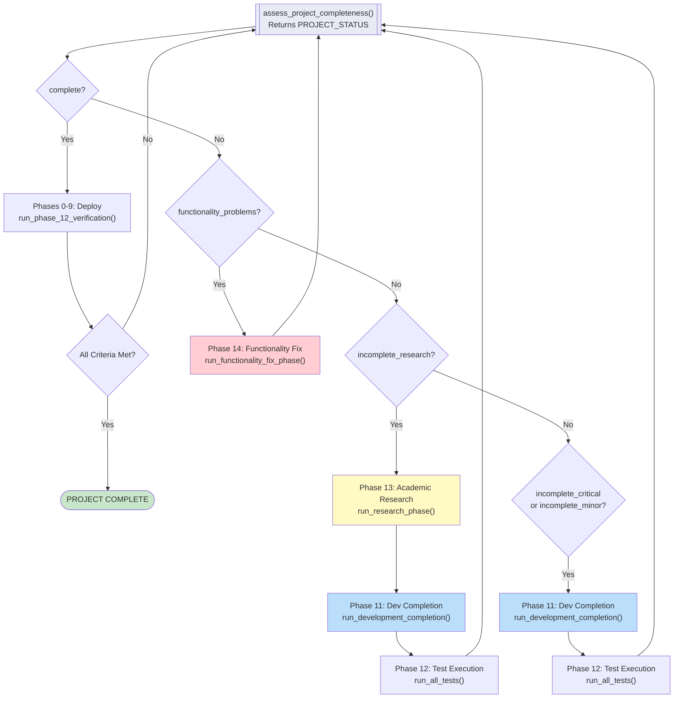
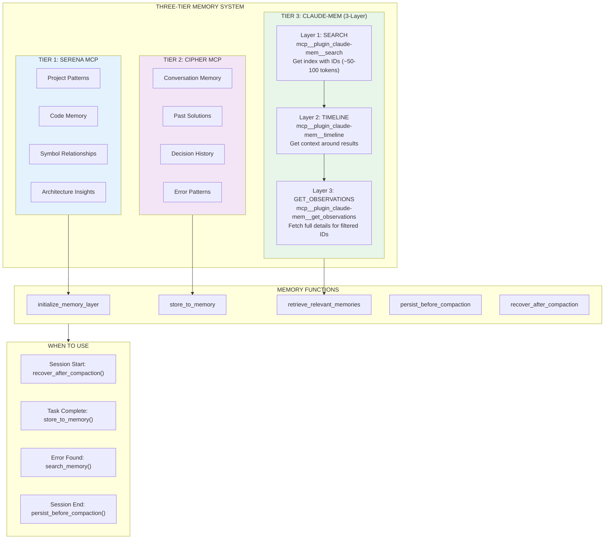
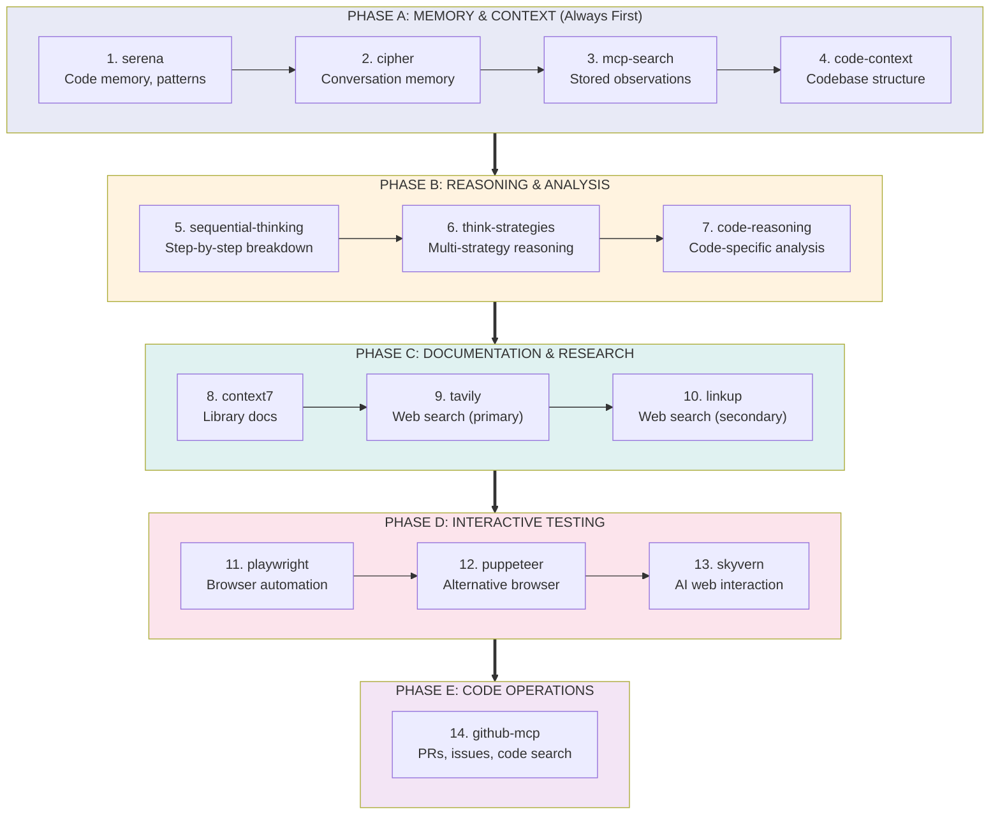
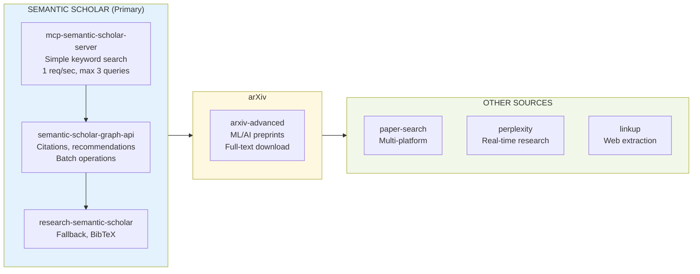

# Ralph Orchestration Visual Documentation

> **Purpose**: Comprehensive visual guide showing how Ralph orchestration works from start to finish.
> **Version**: 2.0.0 | **Updated**: 2026-01-17

---

## Table of Contents

0. [v2.0 Dynamic Routing (NEW)](#0-v20-dynamic-routing-new)
1. [Master Orchestration Flow](#1-master-orchestration-flow)
2. [Phase Relationship Diagram](#2-phase-relationship-diagram)
3. [Project Status Decision Tree](#3-project-status-decision-tree)
4. [Memory Integration System](#4-memory-integration-system)
5. [MCP Tool Priority Orchestration](#5-mcp-tool-priority-orchestration)
6. [ASCII Art Diagrams](#6-ascii-art-diagrams-terminal-display)

---

## 0. v2.0 Dynamic Routing (NEW)

The v2.0 orchestration uses `decide_next_phase()` for dynamic routing - any phase can route to any other phase based on current state analysis.



### Key v2.0 Features

```
┌─────────────────────────────────────────────────────────────────────────────┐
│                    v2.0 ENHANCEMENT SUMMARY                                  │
├─────────────────────────────────────────────────────────────────────────────┤
│                                                                             │
│  1. DYNAMIC ROUTING (decide_next_phase)                                     │
│     ├─ Multi-signal state analysis                                          │
│     ├─ Any phase → Any phase routing                                        │
│     └─ Priority-based selection matrix                                      │
│                                                                             │
│  2. GUARANTEED COMPLETION (No MAX_ITERATIONS)                               │
│     ├─ while true loop (no hard cap)                                        │
│     ├─ Stuck detection with escalation                                      │
│     └─ Human-assisted mode for truly stuck states                           │
│                                                                             │
│  3. ENHANCED SELF-HEALING                                                   │
│     ├─ Actually resolves blockers (not just creates tasks)                  │
│     ├─ Import error → pip install                                           │
│     ├─ Test failure → Phase 14                                              │
│     └─ Memory query for similar past solutions                              │
│                                                                             │
│  4. BD SYNC EVERY ITERATION                                                 │
│     └─ Beads state persisted continuously                                   │
│                                                                             │
│  5. CONDITIONAL MCP SELECTION (select_mcp_tools_for_error)                  │
│     ├─ ImportError → serena, code-context                                   │
│     ├─ RuntimeError → sequential-thinking, code-reasoning                   │
│     ├─ research_needed → arxiv, semantic-scholar, perplexity                │
│     └─ external_api → tavily, linkup, playwright                            │
│                                                                             │
│  6. RESEARCH FEEDBACK LOOP                                                  │
│     ├─ Confidence calculation (0-100)                                       │
│     ├─ Gap identification (missing aspects)                                 │
│     └─ New query generation until threshold met                             │
│                                                                             │
│  7. CROSS-ITERATION AGGREGATION                                             │
│     └─ Merges findings from previous sessions                               │
│                                                                             │
└─────────────────────────────────────────────────────────────────────────────┘
```

---

## 1. Master Orchestration Flow

Complete end-to-end flow from `ralph-init` through project completion.



---

## 2. Phase Relationship Diagram

Shows how phases connect and which phases call which.

```mermaid
flowchart LR
    subgraph PART1["PART 1: INFRASTRUCTURE (Phases 0-9)"]
        direction TB
        P0["0: System Audit<br/>run_system_audit()"]
        P1["1: Dependency Analysis<br/>analyze_project_dependencies()"]
        P2["2: Conda Environment<br/>create_env_if_not_exists()"]
        P3["3: CUDA Installation<br/>install_cuda_packages()"]
        P4["4: Standard Dependencies<br/>install_standard_deps()"]
        P5["5: Database Setup<br/>setup_database()"]
        P6["6: Docker Port Audit<br/>audit_docker_ports()"]
        P7["7: MCP Tool Orchestration<br/>configure_mcp_servers()"]
        P8["8: Ralph-Loop Entry<br/>ralph_loop_entry()"]
        P9["9: Verification & Testing<br/>verify_environment()"]

        P0 --> P1 --> P2 --> P3 --> P4 --> P5 --> P6 --> P7 --> P8 --> P9
    end

    subgraph PART2["PART 2: EXECUTION (Phases 10-15)"]
        direction TB
        P10["10: Gap Detection<br/>analyze_and_create_gap_task()"]
        P105["10.5: Project Assessment<br/>assess_project_completeness()"]
        P11["11: Dev Completion<br/>run_development_completion()"]
        P12["12: Test Execution<br/>run_all_tests()"]
        P13["13: Academic Research<br/>run_academic_research()"]
        P14["14: Functionality Fix<br/>fix_functionality_problems()"]
        P15["15: Master Orchestration<br/>run_master_orchestration()"]

        P10 --> P105
        P105 --> P11
        P105 --> P13
        P105 --> P14
        P13 --> P11
        P11 --> P12
        P12 --> P105
        P14 --> P105
        P15 -.->|controls| P105
    end

    PART1 ==> PART2
    P9 --> P10

    style P0 fill:#e1f5fe
    style P15 fill:#fff3e0
    style P105 fill:#f3e5f5
```



---

## 3. Project Status Decision Tree

Routing logic based on `assess_project_completeness()` results.



---

## 4. Memory Integration System

Three-tier memory system for cross-session context retention.



---

## 5. MCP Tool Priority Orchestration

Five phases of tool orchestration based on task type.



### Research-Specific MCP Priority (Phase 13)



---

## 6. ASCII Art Diagrams (Terminal Display)

For display in terminals without Mermaid rendering support.

### 6.1 Master Flow (80-char width)

```
┌─────────────────────────────────────────────────────────────────────────────┐
│                        RALPH MASTER ORCHESTRATION FLOW                       │
├─────────────────────────────────────────────────────────────────────────────┤
│                                                                             │
│  ┌──────────────┐      ┌──────────────┐      ┌──────────────┐              │
│  │ ralph-init   │─────►│ Initialize   │─────►│ ralph-loop   │              │
│  │              │      │ .ralph/      │      │              │              │
│  └──────────────┘      └──────────────┘      └──────┬───────┘              │
│                                                      │                      │
│  ════════════════════════════════════════════════════╪════════════════════  │
│  PART 1: INFRASTRUCTURE (Phases 0-9)                 ▼                      │
│  ════════════════════════════════════════════════════════════════════════   │
│                                                                             │
│  ┌─────────┐ ┌─────────┐ ┌─────────┐ ┌─────────┐ ┌─────────┐              │
│  │ Phase 0 │►│ Phase 1 │►│ Phase 2 │►│ Phase 3 │►│ Phase 4 │              │
│  │ Audit   │ │ Deps    │ │ Conda   │ │ CUDA    │ │ Install │              │
│  └─────────┘ └─────────┘ └─────────┘ └─────────┘ └────┬────┘              │
│                                                       │                     │
│  ┌─────────┐ ┌─────────┐ ┌─────────┐ ┌─────────┐     │                     │
│  │ Phase 9 │◄│ Phase 8 │◄│ Phase 7 │◄│ Phase 6 │◄────┘                     │
│  │ Verify  │ │ Entry   │ │ MCP     │ │ Docker  │ ◄─── Phase 5 (DB)         │
│  └────┬────┘ └─────────┘ └─────────┘ └─────────┘                           │
│       │                                                                     │
│  ═════╪═════════════════════════════════════════════════════════════════   │
│  PART│2: EXECUTION (Phases 10-15)                                          │
│  ═════╪═════════════════════════════════════════════════════════════════   │
│       ▼                                                                     │
│  ┌──────────┐     ┌────────────┐                                           │
│  │ Phase 10 │────►│ Phase 10.5 │                                           │
│  │ Gap Det. │     │ Assessment │◄──────────────────────────────────┐       │
│  └──────────┘     └─────┬──────┘                                   │       │
│                         │                                          │       │
│              ┌──────────┼──────────┬──────────┬──────────┐         │       │
│              ▼          ▼          ▼          ▼          ▼         │       │
│         ┌────────┐ ┌────────┐ ┌────────┐ ┌────────┐ ┌────────┐     │       │
│         │complete│ │critical│ │ minor  │ │research│ │func_   │     │       │
│         └───┬────┘ └───┬────┘ └───┬────┘ └───┬────┘ │problems│     │       │
│             │          │          │          │      └───┬────┘     │       │
│             ▼          │          │          ▼          │          │       │
│        ┌────────┐      │          │     ┌────────┐      │          │       │
│        │ DEPLOY │      └──────────┼────►│Phase 13│      │          │       │
│        │ (0-9)  │                 │     │Research│      ▼          │       │
│        └───┬────┘                 │     └───┬────┘ ┌────────┐      │       │
│            │                      ▼         │      │Phase 14│      │       │
│            ▼                 ┌────────┐     │      │  Fix   │      │       │
│       ┌─────────┐            │Phase 11│◄────┘      └───┬────┘      │       │
│       │ VERIFY  │            │  Dev   │                │          │       │
│       └────┬────┘            └───┬────┘                └──────────┘       │
│            │                     │                                         │
│     ┌──────┴──────┐              ▼                                         │
│     │             │         ┌────────┐                                     │
│     ▼             ▼         │Phase 12│                                     │
│  ┌──────┐    ┌────────┐     │ Test   │                                     │
│  │ DONE │    │ ITERATE│     └───┬────┘                                     │
│  │      │    │        │         │                                          │
│  └──────┘    └────┬───┘         └─────────────────────────────────────────►┤
│                   │                                                         │
│                   └────────────────────────────────────────────────────────►┤
│                                                                             │
└─────────────────────────────────────────────────────────────────────────────┘
```

### 6.2 Phase Groups

```
┌─────────────────────────────────────────────────────────────────────────────┐
│                        RALPH ORCHESTRATION PHASES                            │
├─────────────────────────────────────────────────────────────────────────────┤
│                                                                             │
│  ┌─────────────────────────────┐    ┌─────────────────────────────┐        │
│  │     INFRASTRUCTURE          │    │       EXECUTION              │        │
│  │     (PART1: 0-9)           │    │       (PART2: 10-15)        │        │
│  │                             │    │                             │        │
│  │  0. System Audit ◄──────────┼────┤  10.  Gap Detection         │        │
│  │  1. Dependency Analysis     │    │  10.5 Project Assessment ◄──┼─┐      │
│  │  2. Conda Environment       │    │  11.  Dev Completion     ───┼─┤      │
│  │  3. CUDA Installation       │    │  12.  Test Execution     ───┼─┤      │
│  │  4. Standard Dependencies   │    │  13.  Academic Research  ───┼─┤      │
│  │  5. Database Setup          │    │  14.  Functionality Fix  ───┼─┘      │
│  │  6. Docker Port Audit       │    │  15.  Master Orchestration  │        │
│  │  7. MCP Tool Orchestration  │    │                             │        │
│  │  8. Ralph-Loop Entry ───────┼────►                             │        │
│  │  9. Verification & Testing  │    │                             │        │
│  │                             │    │                             │        │
│  └─────────────────────────────┘    └─────────────────────────────┘        │
│                                                                             │
└─────────────────────────────────────────────────────────────────────────────┘
```

### 6.3 Decision Routing

```
┌─────────────────────────────────────────────────────────────────────────────┐
│                     PROJECT STATUS ROUTING                                   │
├─────────────────────────────────────────────────────────────────────────────┤
│                                                                             │
│                    assess_project_completeness()                            │
│                              │                                              │
│              ┌───────────────┼───────────────┐                              │
│              ▼               ▼               ▼                              │
│         ┌────────┐     ┌──────────┐    ┌────────────┐                       │
│         │complete│     │incomplete│    │functionality│                      │
│         └────┬───┘     └────┬─────┘    │  problems  │                       │
│              │              │          └─────┬──────┘                       │
│              ▼              │                │                              │
│      ┌──────────────┐       │                ▼                              │
│      │ Deploy (0-9) │       │         ┌────────────┐                        │
│      │              │       │         │ Phase 14   │                        │
│      │ >>> COMPLETE │       │         │ Fix Issues │                        │
│      └──────────────┘       │         └─────┬──────┘                        │
│                             │               │                               │
│              ┌──────────────┼───────────────┘                               │
│              ▼              ▼                                               │
│         ┌─────────┐    ┌──────────┐                                         │
│         │critical │    │ research │                                         │
│         │ /minor  │    │          │                                         │
│         └────┬────┘    └────┬─────┘                                         │
│              │              │                                               │
│              │              ▼                                               │
│              │      ┌────────────┐                                          │
│              │      │ Phase 13   │                                          │
│              │      │ Research   │                                          │
│              │      └─────┬──────┘                                          │
│              │            │                                                 │
│              └─────┬──────┘                                                 │
│                    ▼                                                        │
│            ┌────────────┐                                                   │
│            │ Phase 11   │                                                   │
│            │ Dev Work   │                                                   │
│            └─────┬──────┘                                                   │
│                  │                                                          │
│                  ▼                                                          │
│            ┌────────────┐                                                   │
│            │ Phase 12   │                                                   │
│            │ Testing    │◄──────────────────────────────────┐               │
│            └─────┬──────┘                                   │               │
│                  │                                          │               │
│                  ▼                                          │               │
│            ┌────────────┐      ┌─────────┐                  │               │
│            │ Re-assess  │─────►│ ITERATE │──────────────────┘               │
│            │            │      │ (Loop)  │                                  │
│            └────────────┘      └─────────┘                                  │
│                                                                             │
└─────────────────────────────────────────────────────────────────────────────┘
```

### 6.4 Memory System

```
┌─────────────────────────────────────────────────────────────────────────────┐
│                    THREE-TIER MEMORY SYSTEM                                  │
├─────────────────────────────────────────────────────────────────────────────┤
│                                                                             │
│  ┌───────────────────────────────────────────────────────────────────────┐  │
│  │ TIER 1: SERENA MCP                                                    │  │
│  │ ├─ Project patterns        (mcp__serena__read_memory)                 │  │
│  │ ├─ Code memory             (mcp__serena__write_memory)                │  │
│  │ ├─ Symbol relationships    (mcp__serena__find_symbol)                 │  │
│  │ └─ Architecture insights   (mcp__serena__list_memories)               │  │
│  └───────────────────────────────────────────────────────────────────────┘  │
│                                     │                                       │
│                                     ▼                                       │
│  ┌───────────────────────────────────────────────────────────────────────┐  │
│  │ TIER 2: CIPHER MCP                                                    │  │
│  │ ├─ Conversation memory     (mcp__cipher__ask_cipher)                  │  │
│  │ ├─ Past solutions          "Recall previous context for: X"           │  │
│  │ ├─ Decision history        "What decisions were made about: Y"        │  │
│  │ └─ Error patterns          "What errors occurred with: Z"             │  │
│  └───────────────────────────────────────────────────────────────────────┘  │
│                                     │                                       │
│                                     ▼                                       │
│  ┌───────────────────────────────────────────────────────────────────────┐  │
│  │ TIER 3: CLAUDE-MEM (3-Layer Workflow)                                 │  │
│  │                                                                       │  │
│  │  ┌─────────────────────────────────────────────────────────────────┐  │  │
│  │  │ LAYER 1: SEARCH                                                 │  │  │
│  │  │ mcp__plugin_claude-mem_mcp-search__search                       │  │  │
│  │  │ Returns: Index with IDs (~50-100 tokens/result)                 │  │  │
│  │  └────────────────────────────┬────────────────────────────────────┘  │  │
│  │                               ▼                                       │  │
│  │  ┌─────────────────────────────────────────────────────────────────┐  │  │
│  │  │ LAYER 2: TIMELINE                                               │  │  │
│  │  │ mcp__plugin_claude-mem_mcp-search__timeline                     │  │  │
│  │  │ Returns: Context around interesting results                     │  │  │
│  │  └────────────────────────────┬────────────────────────────────────┘  │  │
│  │                               ▼                                       │  │
│  │  ┌─────────────────────────────────────────────────────────────────┐  │  │
│  │  │ LAYER 3: GET_OBSERVATIONS                                       │  │  │
│  │  │ mcp__plugin_claude-mem_mcp-search__get_observations             │  │  │
│  │  │ Returns: Full details for filtered IDs ONLY (10x token savings) │  │  │
│  │  └─────────────────────────────────────────────────────────────────┘  │  │
│  │                                                                       │  │
│  └───────────────────────────────────────────────────────────────────────┘  │
│                                                                             │
│  KEY FUNCTIONS:                                                             │
│  ├─ initialize_memory_layer()    - Setup at session start                   │
│  ├─ store_to_memory()            - Persist learning after task              │
│  ├─ retrieve_relevant_memories() - Search for context                       │
│  ├─ persist_before_compaction()  - Save before /clear                       │
│  └─ recover_after_compaction()   - Restore after /clear                     │
│                                                                             │
└─────────────────────────────────────────────────────────────────────────────┘
```

### 6.5 MCP Tool Priority

```
┌─────────────────────────────────────────────────────────────────────────────┐
│                    MCP SERVER ORCHESTRATION ORDER                           │
├─────────────────────────────────────────────────────────────────────────────┤
│                                                                             │
│  PHASE A: MEMORY & CONTEXT (Always First)                                  │
│  ├─ 1. serena          → Code memory, project patterns                     │
│  ├─ 2. cipher          → Conversation memory, past solutions               │
│  ├─ 3. mcp-search      → Search stored observations/memories               │
│  └─ 4. code-context    → Codebase structure analysis                       │
│                                                                             │
│  PHASE B: REASONING & ANALYSIS                                             │
│  ├─ 5. sequential-thinking → Step-by-step problem breakdown                │
│  ├─ 6. think-strategies    → Multi-strategy reasoning                      │
│  └─ 7. code-reasoning      → Code-specific logical analysis                │
│                                                                             │
│  PHASE C: DOCUMENTATION & RESEARCH                                         │
│  ├─ 8. context7        → Library/framework documentation                   │
│  ├─ 9. tavily          → Web search (primary)                              │
│  └─ 10. linkup         → Web search (secondary/real-time)                  │
│                                                                             │
│  PHASE D: INTERACTIVE TESTING                                              │
│  ├─ 11. playwright     → Browser automation, API testing                   │
│  ├─ 12. puppeteer      → Browser automation (alternative)                  │
│  └─ 13. skyvern        → AI-powered web interaction                        │
│                                                                             │
│  PHASE E: CODE OPERATIONS                                                  │
│  └─ 14. github-mcp     → GitHub PRs, issues, code search                   │
│                                                                             │
├─────────────────────────────────────────────────────────────────────────────┤
│  RESEARCH-SPECIFIC (Phase 13 Academic Research):                           │
│                                                                             │
│  SEMANTIC SCHOLAR (Primary - use in order):                                │
│  ├─ 1. mcp-semantic-scholar-server → Simple keyword (1 req/sec, max 3)     │
│  ├─ 2. semantic-scholar-graph-api  → Citations, recommendations, batch     │
│  └─ 3. research-semantic-scholar   → Fallback, BibTeX generation           │
│                                                                             │
│  arXiv:                                                                    │
│  └─ arxiv-advanced → ML/AI preprints, full-text download                   │
│                                                                             │
│  Other Sources:                                                            │
│  ├─ paper-search → Multi-platform aggregation                              │
│  ├─ perplexity   → Real-time web research                                  │
│  └─ linkup       → Web search and extraction                               │
│                                                                             │
└─────────────────────────────────────────────────────────────────────────────┘
```

---

## Quick Reference Card

```
┌─────────────────────────────────────────────────────────────────────────────┐
│                    RALPH QUICK REFERENCE                                     │
├─────────────────────────────────────────────────────────────────────────────┤
│                                                                             │
│  ENTRY COMMANDS:                                                            │
│  ├─ ralph-init <PROJECT_PATH>     → Initialize orchestration                │
│  └─ ralph-loop <PROJECT_PATH>     → Start/continue loop                     │
│                                                                             │
│  PROJECT STATUS VALUES:                                                     │
│  ├─ complete               → Deploy and verify                              │
│  ├─ functionality_problems → Route to Phase 14 (Fix)                        │
│  ├─ incomplete_research    → Route to Phase 13 → 11                         │
│  ├─ incomplete_critical    → Route to Phase 11 (Dev)                        │
│  └─ incomplete_minor       → Route to Phase 11 (Dev)                        │
│                                                                             │
│  ITERATION CYCLE:                                                           │
│  ┌─────────────────────────────────────────────────────────────────────┐   │
│  │ ASSESS → ROUTE → EXECUTE → VERIFY → (loop or complete)              │   │
│  └─────────────────────────────────────────────────────────────────────┘   │
│                                                                             │
│  COMPLETION CRITERIA:                                                       │
│  [ ] No NotImplementedError in code                                         │
│  [ ] All imports work                                                       │
│  [ ] All tests pass                                                         │
│  [ ] No blocked Beads tasks                                                 │
│  [ ] No open Beads tasks                                                    │
│  [ ] No in_progress Beads tasks                                             │
│  [ ] FUNCTIONALITY_SCORE = 0                                                │
│                                                                             │
│  CONTEXT RECOVERY:                                                          │
│  1. mcp__serena__read_memory("orchestration-essentials.md")                 │
│  2. bd ready                                                                │
│  3. cat .ralph/progress.txt | tail -20                                      │
│                                                                             │
│  SIGNAL COMPLETION:                                                         │
│  <promise>COMPLETE</promise>                                                │
│                                                                             │
└─────────────────────────────────────────────────────────────────────────────┘
```

---

## Related Documentation

| Document | Purpose |
|----------|---------|
| `MASTER_PROMPT_TEMPLATE.md` | Full orchestration documentation |
| `PART1_INFRASTRUCTURE.md` | Phases 0-9 detailed |
| `PART2_EXECUTION.md` | Phases 10-15 detailed |
| `ORCHESTRATION_ESSENTIALS.md` | Quick reference guide |
| `prd.json` | Current project definition |
| `progress.txt` | Iteration log |
